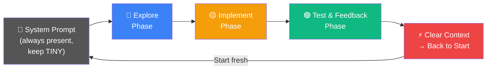
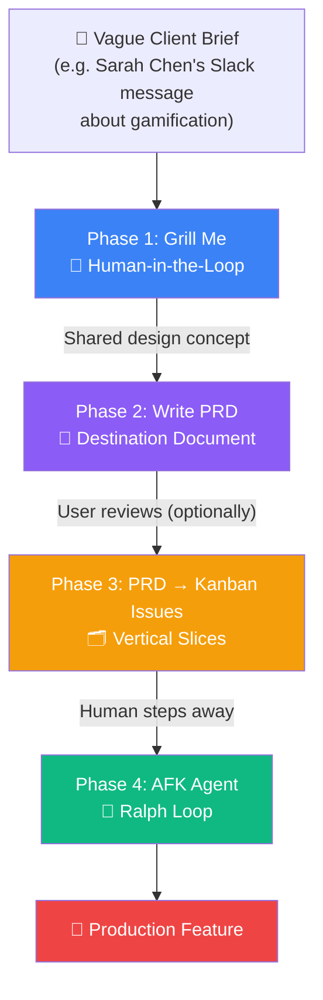
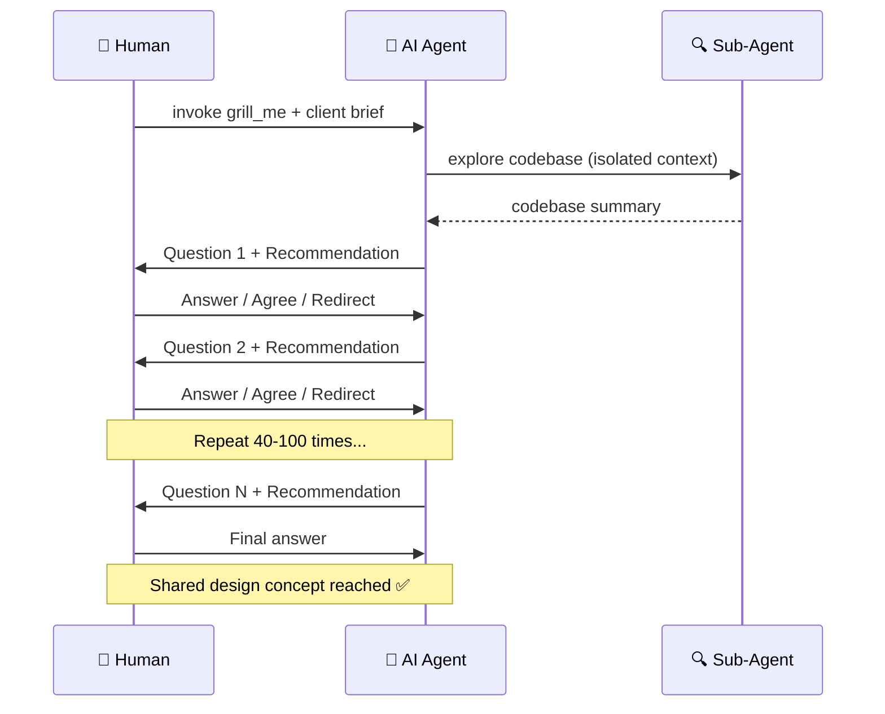
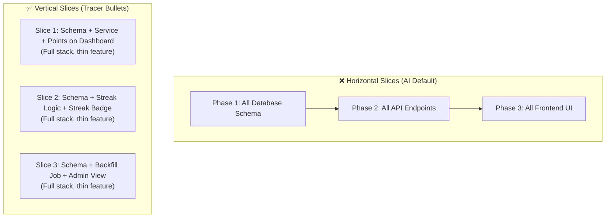
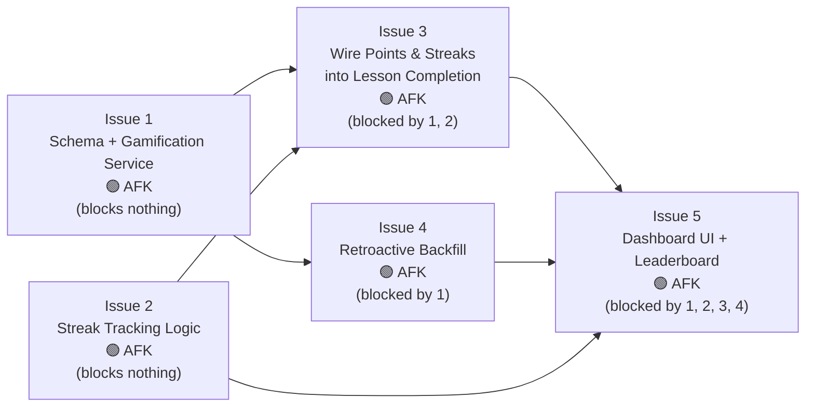
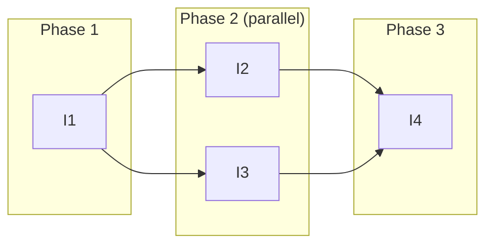
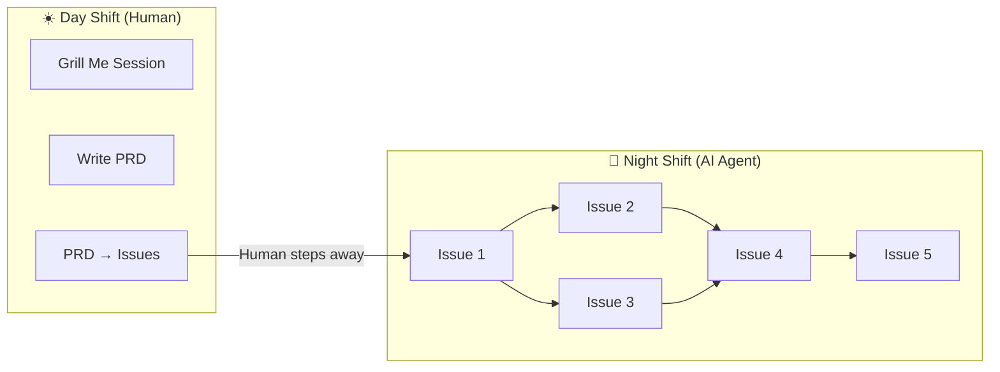
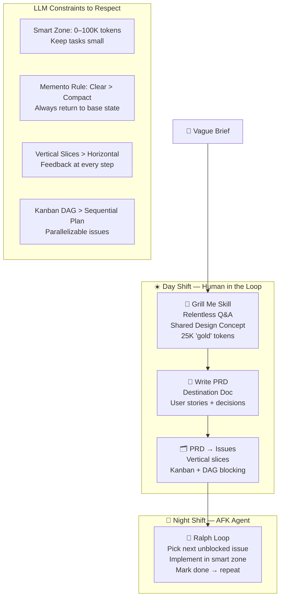

> **Source:** Conference workshop by Matt Pocock ([@mattpocockuk](https://x.com/mattpocockuk))
> **Published:** April 24, 2026 · [Watch on YouTube](https://youtu.be/-QFHIoCo-Ko)
> **Format:** ~2-hour live workshop with exercises and live Q&A

## Executive Summary

Matt Pocock, TypeScript educator turned AI teacher, argues that the biggest unlock in AI-assisted coding isn't new tools — it's **applying classic software engineering fundamentals** (from books like *The Pragmatic Programmer* and *The Design of Design*) to how you work with LLMs. His core thesis: AI is a new paradigm, but the old rules still apply.

The workflow he presents is a **four-phase pipeline** that moves from a vague brief to autonomously implemented production code, with careful attention to LLM constraints at every step.

---

## Part 1: Understanding LLM Constraints

Before introducing his workflow, Matt establishes two foundational mental models that shape every decision in the pipeline.

### 🧠 Mental Model 1 — The Smart Zone vs. The Dumb Zone

```
Token Count:    0 ────────── ~100K ──────────────────── ∞
                │                  │
                │  SMART ZONE      │     DUMB ZONE
                │  (Best work)     │  (Degraded quality)
                │                  │
                └──────────────────┴────────────────────
```

Every token added to an LLM context creates new **attention relationships** — essentially every token needs to attend to every other. This scales quadratically, meaning around **~100K tokens** the model starts making noticeably worse decisions.

> *"It doesn't matter whether you're using a 1 million context window or 200K. It's always going to be about [100K]. It starts to just get dumber."*

**Key implication:** Size tasks to fit within the smart zone. Don't let the AI "bite off more than it can chew."

Matt tracks the live token count visible in the status bar of Claude Code for every session — he considers this **essential information**.

### 🧠 Mental Model 2 — LLMs Are Like the Guy from Memento

Every session with an LLM goes through the same lifecycle:



When you **clear context**, you return to *exactly* the system prompt — like the amnesiac protagonist in *Memento*. Matt **prefers this** over compacting.

**Compacting vs. Clearing:**

| | Compacting | Clearing (Matt's preference) |
|---|---|---|
| What happens | Session history is summarized and retained | Everything after system prompt is deleted |
| Matt's take | ❌ Hates it — creates "sediment" | ✅ Loves it — predictable, always the same state |
| Risk | Accumulated errors in summary | None — always fresh start |

> *"I prefer my AI to behave like the guy from Memento because this state is always the same. Always the same."*

## Part 2: The Four-Phase Workflow

The full pipeline takes a vague client brief all the way to production-ready code. Here's the end-to-end view:



### Phase 1 — The Grill Me Session

**Goal:** Reach a *shared design concept* — the same mental model of the feature between you and the AI. This is NOT about producing a plan. It's about reaching alignment.

**The Skill:**
```
Interview me relentlessly about every aspect of this plan
until we reach a shared understanding. Walk down each
branch of the design tree, resolving dependencies one by
one. For each question, provide your recommended answer.
Ask the questions one at a time.
```

**What happens:**
1. Clear context → invoke `grill_me` skill + client brief
2. AI spawns a **sub-agent** to explore the codebase (isolated context, reports summary back)
3. AI asks targeted questions **one at a time**, always providing its own recommendation
4. Human answers, agrees, or redirects — quickly
5. Session ends with a 25K-token conversation of "gold" — the design concept

**Key characteristics:**
- Sessions can run **40–100 questions**
- AI recommendations are usually good — often just agree
- Can feed in external meeting transcripts (e.g. Gemini Meetings) for extra context
- Can involve multiple stakeholders (mob planning style)



> *"I needed to reach a shared understanding. I didn't need an asset, I didn't need a plan. I needed to be on the same wavelength as the AI."*

**This is a HUMAN-IN-THE-LOOP task.** It cannot be automated. The human is the domain expert being interviewed.

### Phase 2 — Write the PRD (Destination Document)

**Goal:** Crystallize the shared design concept into a structured **Product Requirements Document** — the *destination* document.

**The `write_prd` skill:**
1. Asks the user for a detailed problem description
2. Explores the repo (if fresh session)
3. Short re-grilling pass to validate assumptions
4. Produces the PRD template

**PRD structure:**
- **Problem statement** — what the user is experiencing
- **Solution** — proposed resolution
- **User stories** (often 15–20 stories)
- **Implementation decisions** — concrete technical choices made during grilling
- **Testing decisions** — how each story will be validated
- **Proposed modules to modify** — keeps code in mind from day one

**Matt's controversial take:** He doesn't read the PRD.
> *"What am I testing at this point? I know LLMs are great at summarization. I have reached the same wavelength as the LLM. So if I have a shared design concept, all I'm doing is checking the LLM's ability to summarize."*

He stores PRDs as GitHub Issues in his work repo, where he has **744 closed issues** from all his projects.

### Phase 3 — PRD to Kanban Issues (The Journey Document)

**Goal:** Break the PRD into **independently grabbable issues** using **vertical slices**, structured as a Kanban board with blocking relationships.

#### The Tracer Bullet / Vertical Slice Concept

This is Matt's most important engineering insight. AI naturally wants to code **horizontally** (layer by layer). This is wrong.



**Why horizontal is bad:** No integrated, testable system until Phase 3. You're coding blind.

**Why vertical is good:** At the end of *every* slice, you have a working, testable end-to-end feature you can see and validate. Feedback loop is tight.

> *"AI loves to code horizontally. What I noticed is that AI loves to code layer by layer. You don't get feedback on your work until you've really started or completed phase three."*

**The tracer bullet analogy:**
> *"When you're an anti-aircraft gunner and it's night... if you're shooting normal bullets, you have no idea where you're firing. Tracer bullets attach a tiny bit of phosphorescence so every sixth bullet you see a line in the sky. You have feedback on where you're aiming."*

#### The Kanban Board Structure

Issues are created with **blocking relationships**, forming a Directed Acyclic Graph (DAG):



**Why Kanban over a sequential multi-phase plan:**
- Sequential plans can only be picked up by **one agent**
- Kanban with a DAG allows **parallel execution** — multiple agents working simultaneously on non-blocking issues
- Parallelization can collapse a 5-phase sequential plan into just 3 parallel phases



### Phase 4 — The AFK Agent (Ralph Loop)

**Goal:** The human steps away. The agent works through the Kanban board autonomously, making small changes toward the destination.

**Structure of the AFK prompt:**
1. Load local issue files from the issues directory
2. Find the next unblocked, unassigned issue
3. Implement it in the smart zone (fresh context per issue)
4. Mark it complete
5. Loop until all issues are done

This is Matt's version of the **Ralph Wiggum loop**:
> *Specify the destination. Loop: "make one small change that gets us closer." Repeat.*

**The Day Shift / Night Shift metaphor:**



> *"We've spent a lot of time planning here, but it means that we've queued up a lot of work for the agent. This is the day shift for the human. Once we kick it over to the night shift, the AI can just work AFK."*

## Part 3: Human-in-the-Loop vs. AFK Tasks

A key framework Matt uses to categorize every task:

| Dimension | 🧑 Human-in-the-Loop | 🤖 AFK Task |
|---|---|---|
| **Examples** | Grill Me, stakeholder review | Implementation, backfill jobs |
| **Why human?** | Requires domain knowledge, judgment, alignment | Well-specified, deterministic, context-bounded |
| **Can it loop?** | ❌ No — Ralph loop doesn't work here | ✅ Yes — ideal for Ralph loop |
| **Analogy** | Day shift | Night shift |
| **Token strategy** | Fresh context each session | Keep in smart zone per issue |

> *"Planning — this alignment phase — has to be human in the loop. Has to be. I can't loop over this."*

## Part 4: Critiques of Existing Approaches

Matt explicitly calls out several popular patterns as **anti-patterns**:

### ❌ Specs-to-Code
The idea that you write a spec, pass it to AI, and never look at the code again — just keep editing the spec.

> *"It sucks. It doesn't work because you need to keep a handle on the code. You need to understand what's in it. You need to shape it because the code is your battleground."*

### ❌ Compacting
Summarizing a long session into a compressed history to continue work.

Matt prefers **clearing** because compacting:
- Accumulates errors and "sediment" across summaries
- Creates unpredictable state
- Clears are always the same, always predictable

### ❌ Horizontal Slices
Completing all database work first, then all API work, then all frontend work.

No testable feedback until all layers are done. AI codes blind.

### ❌ Over-relying on Frameworks (Spec-it, Taskmaster, etc.)
Using pre-packaged planning frameworks you don't understand.

> *"I believe in inversion of control and you should be in control of the stack. If it breaks and you don't own it, you just go 'This isn't working. This sucks.' Whereas if you have control over the whole thing, at least you know how to fix it."*

### ❌ Large System Prompts
Putting 250K tokens in your system prompt means you start in the dumb zone immediately.

> *"You want this to be tiny."*

## Part 5: Key Tools & Skills

| Tool / Skill | Phase | Purpose |
|---|---|---|
| `grill_me` | Phase 1 | Relentless AI-driven interview to reach shared design concept |
| `write_prd` | Phase 2 | Converts grilling session into structured destination document |
| `prd_to_issues` | Phase 3 | Breaks PRD into vertical-slice kanban issues with blocking relationships |
| **Sub-agents** | Phase 1 | Isolated context exploration — delegate, summarize, report back |
| **Token counter** | All phases | Real-time awareness of proximity to dumb zone |
| **AFK / Ralph loop** | Phase 4 | Autonomous issue-by-issue implementation agent |

## Part 6: Key Quotes

> *"Software engineering fundamentals — the stuff that's really crucial to working with humans — also works super well with AI."*

> *"Code is your battleground."*

> *"I didn't need an asset. I didn't need a plan. I needed to be on the same wavelength as the AI — a shared design concept."*

> *"Bad codebases make bad agents."*

> *"AI loves to code horizontally. You don't get feedback on your work until you've really started or completed phase three."*

> *"Planning — this alignment phase — has to be human in the loop. Has to be."*

> *"We've queued up a lot of work for the agent. This is the day shift for the human. Once we kick it over to the night shift, the AI can just work AFK."*

> *"Democracy is the worst way to run a country apart from all the other ways. That's how I feel about Claude Code."*

## Summary: The Whole System on One Page



*Report generated from the transcript of Matt Pocock's ~2-hour conference workshop, April 24, 2026.*
